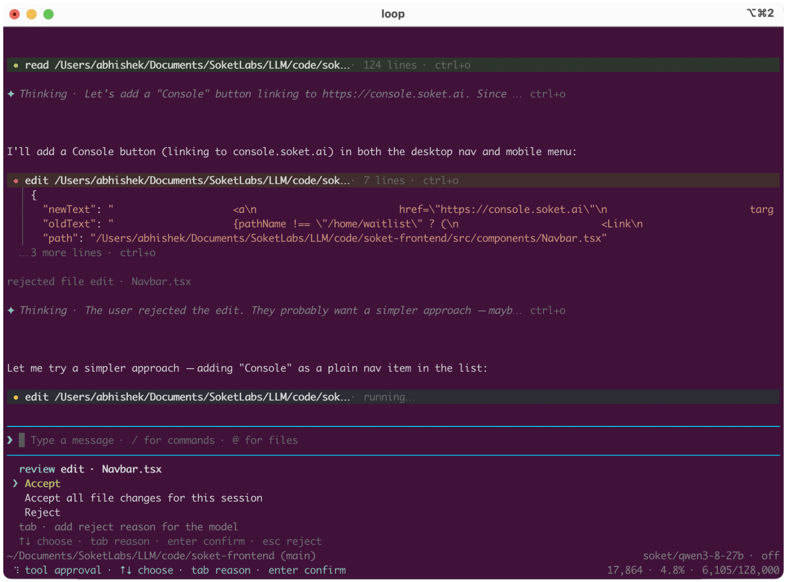

# loop

Open-source Rust agent harness by [**Soket AI**](https://soket.ai): an agent loop with tool use, sessions, sandboxing, and a unified LLM provider API. Designed to be performant and memory-efficient for long-running agents on the most critical workloads.

<picture>
  
</picture>

Docs: [https://loop.soket.ai/](https://loop.soket.ai/)

## Crates

| Crate | Path | Role |
|-------|------|------|
| **loop-ai** | [`crates/loop-ai`](crates/loop-ai) | Unified LLM API, Soket provider (`/v1/models` refresh), OpenAI-compat + faux |
| **loop-agent** | [`crates/loop-agent`](crates/loop-agent) | Agent loop, AgentHarness, tools, sessions, sandbox, skills |
| **loop-cli** | [`crates/loop-cli`](crates/loop-cli) | Interactive `loop` TUI (ratatui) |

## Quick start

Install the CLI from GitHub Releases:

```bash
curl -fsSL https://loop.soket.ai/install | bash
```

That downloads the latest `loop` binary for your OS into `~/.loop/bin` and adds it to `PATH`. Pin a version or skip PATH edits:

```bash
curl -fsSL https://loop.soket.ai/install | bash -s -- --version 0.3.2
curl -fsSL https://loop.soket.ai/install | bash -s -- --no-modify-path
```

From a clone of this repo you can also run `./install.sh`. Assets come from [soketlabs/loop releases](https://github.com/soketlabs/loop/releases).

Build from source:

```bash
cargo run -p loop-cli
```

First run asks you to connect a model provider: Soket, OpenRouter, OpenAI, or any OpenAI-compatible API (`/login` later to add more). Alternatively set `SOKET_API_KEY`, `OPENROUTER_API_KEY` or `OPENAI_API_KEY`. Config lives under `~/.loop/agent/`. See [`crates/loop-cli/README.md`](crates/loop-cli/README.md).

## Build / test

```bash
cargo build
cargo test -p loop-ai
cargo test -p loop-agent
cargo test -p loop-cli
```

### Tracing (optional `telemetry` feature)

OpenTelemetry tracing to Langfuse or any OTLP collector is off by default, so the standard build carries no OpenTelemetry dependencies. Build with the feature to get `/tracing` in the TUI and the `--trace-*` flags for benchmark runs with `--print`:

```bash
cargo build -p loop-cli --release --features telemetry
cargo test -p loop-telemetry -p loop-agent -p loop-app-core -p loop-cli \
  --features loop-agent/telemetry,loop-app-core/telemetry,loop-cli/telemetry
```

### CI vs releases

- **CI** (`.github/workflows/ci.yml`) runs on every PR and push to `main`, plus manual **Run workflow**. It builds and tests; it does **not** publish a release.
- **Release** (`.github/workflows/release.yml`) publishes multi-platform binaries only when you cut a version tag (or manually with `create_release`).

Supported release targets:

| Asset | Platform |
|-------|----------|
| `loop-x86_64-unknown-linux-gnu.tar.gz` | Linux x86_64 |
| `loop-aarch64-unknown-linux-gnu.tar.gz` | Linux ARM64 |
| `loop-x86_64-apple-darwin.tar.gz` | macOS Intel |
| `loop-aarch64-apple-darwin.tar.gz` | macOS Apple Silicon |
| `loop-x86_64-pc-windows-msvc.zip` | Windows x64 |

#### Cut a release

1. Bump `[workspace.package] version` in the root `Cargo.toml` (must match the tag without the `v` prefix).
2. Commit, push to `main` (or your release branch).
3. Tag and push the tag:

```bash
git tag v0.1.0
git push origin v0.1.0
```

That starts the Release workflow, builds all targets, and creates a GitHub Release with archives + `.sha256` checksums.

## License

Copyright 2026 Soket AI.

Licensed under the Apache License, Version 2.0. See [LICENSE](LICENSE).